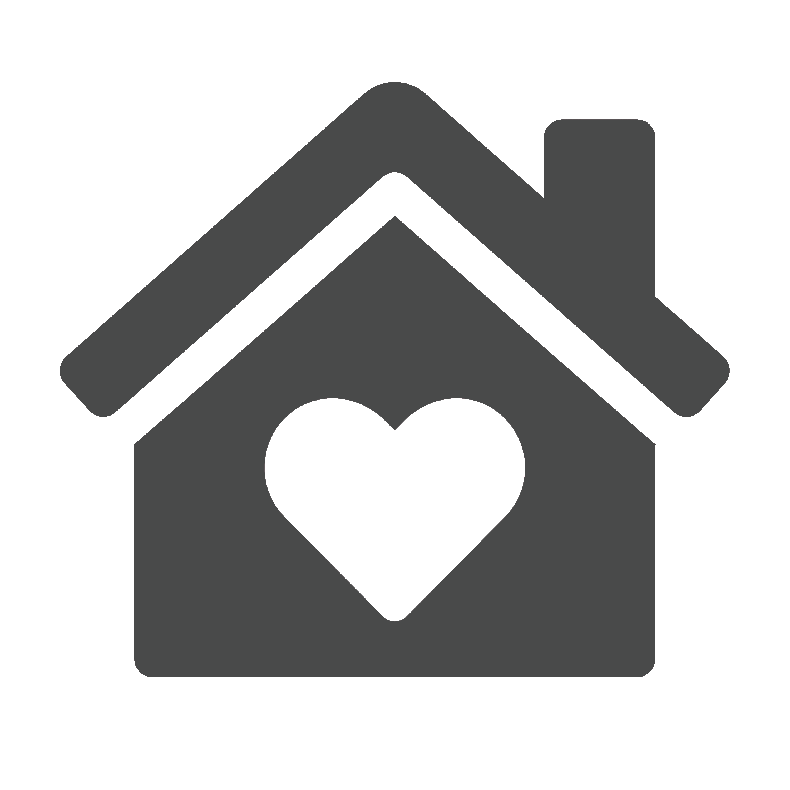

# Our Hair App

This repository holds our capstone group project for Digital Crafts. Near the end of our 16-week course, we were instructed to put all of our newly acquired knowledge to the test by creating a website. We chose to go with a site where a user can sign up and log into their account where they will be asked a few questions about their hair type. From there, You can keep a log of if and when your hair was last dyed as well as up load pictures of your hair from the last time it was cut and what your dream hair would be. This site would help salons and clients with communicating and would save them both time.



### Prerequisites

In order for the project to work on your computer, should you clone it, you'll need to install the following:

```
npm install
npm install moment react-moment
```

## Built With

* [React](https://reactjs.org/) - Used Create React App to start project
* [Moment](https://momentjs.com/) - Used for dates and times for appointments
* [Firebase](https://firebase.google.com/) - Used to create out database and user authentication

## Authors

* **Kyra Mellema** - [KyraTheDork](https://github.com/KyraTheDork)

* **Mulk Abdulhadi** - [Mabdulul](https://github.com/mabdulul)

* **Gilford Williams** - [GilliamD](https://github.com/GilliamD)

* **Rhonda Janell** - [Rjmckenney](https://github.com/rjmckenney)

## Acknowledgments

* Thanks to [Digital Crafts](https://www.digitalcrafts.com/) for our new coding abilities
* Stay Rad, Sean! 🤘
